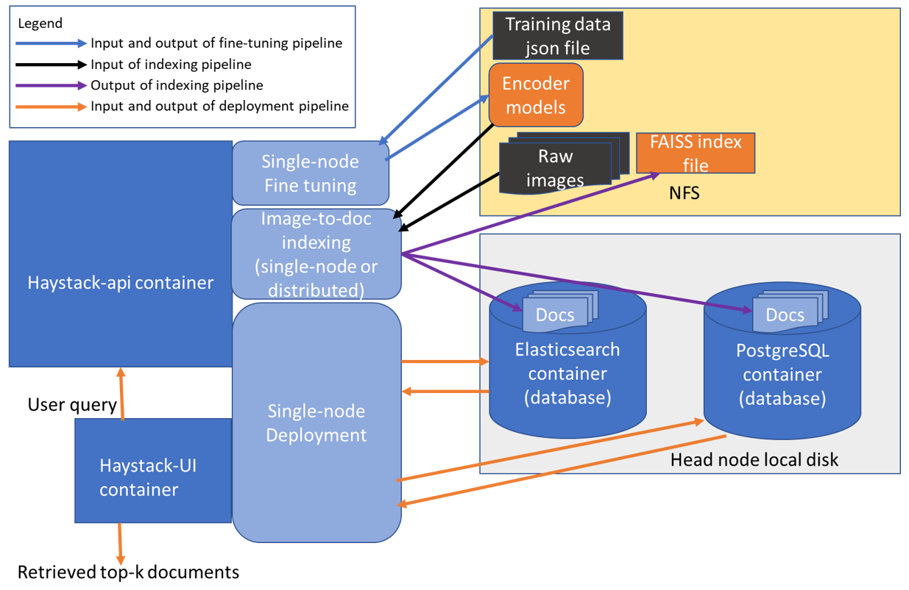
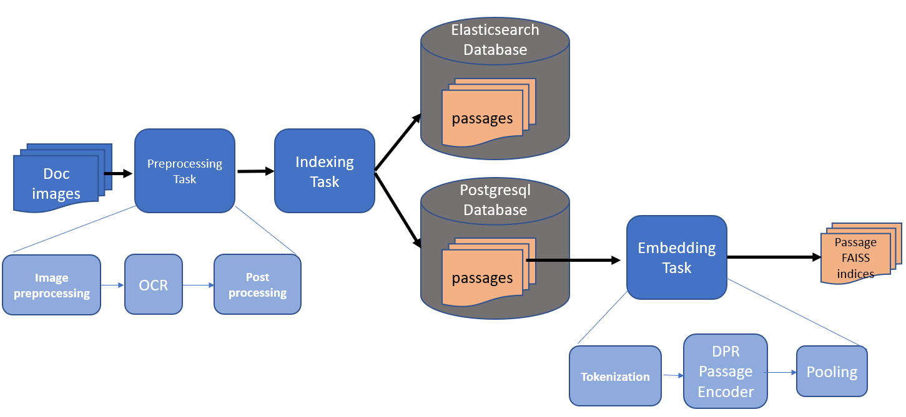
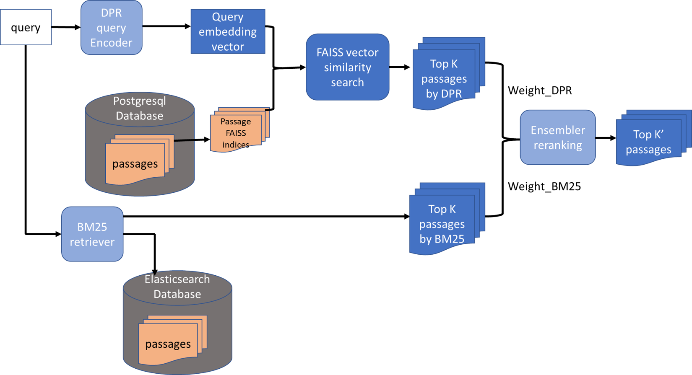
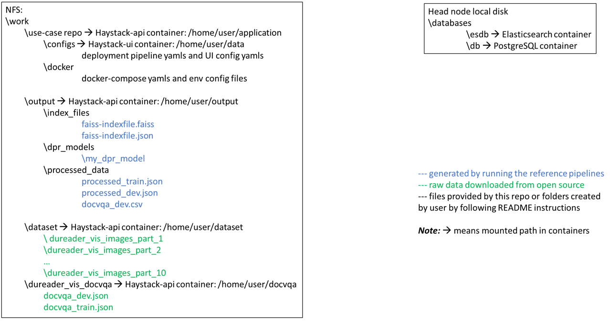
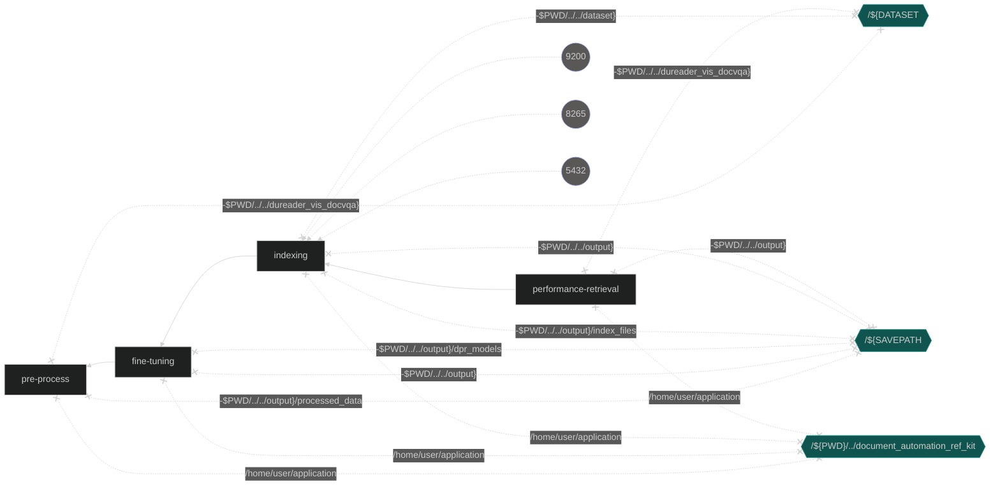
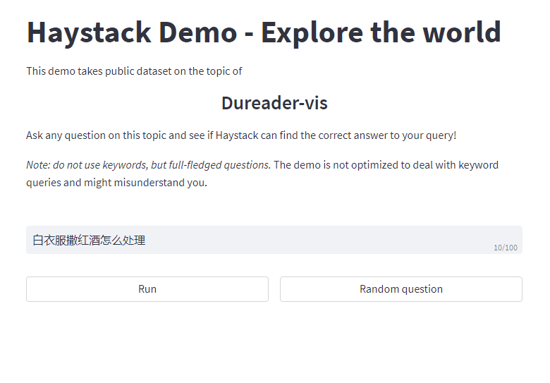

# Document Automation Reference Use Case

## Introduction
This reference use case is an end-to-end reference solution for building an AI-augmented multi-modal semantic search system for document images (for example, scanned documents). This solution can help enterprises gain more insights from their document archives more quickly and easily using natural language queries. 

## Table of Content
- [Solution Technical Overview](#solution-technical-overview)
- [Solution Technical Details](#solution-technical-details)
- [Validated Hardware Details](#validated-hardware-details)
- [How It Works](#how-it-works)
- [Get Started](#get-started)
- [Run Single-Node DPR Fine-Tuning Pipeline with Docker Compose](#run-single-node-dpr-fine-tuning-pipeline-with-docker-compose)
- [Run Indexing Pipeline (Single Node or Distributed)](#run-indexing-pipeline-single-node-or-distributed)
- [Run Single-Node Deployment Pipeline](#run-single-node-deployment-pipeline)
- [Run Using Argo Workflows on K8s Using Helm](#run-using-argo-workflows-on-k8s-using-helm)
- [Summary and Next Steps](#summary-and-next-steps)
- [For Advanced Users](#for-advanced-users)
- [Learn More](#learn-more)
- [Troubleshooting](#troubleshooting)
- [Support](#support)

## Solution Technical Overview
Enterprises are accumulating a vast quantity of documents, a large portion of which is in image formats such scanned documents. These documents contain a large amount of valuable information, but it is a challenge for enterprises to index, search and gain insights from the document images due to the reasons below:
* The end-to-end (e2e) solution involves many components that are not easy to integrate together.
* Indexing a large document image collection is very time consuming. Distributed indexing capability is needed, but there is no open-source solution that is ready to use.
* Query against document image collections with natural language requires multi-modality AI that understands both images and languages. Building such multi-modality AI models requires deep expertise in machine learning.
* Deploying multi-modality AI models together with databases and a user interface is not an easy task.
* Majority of multi-modality AI models can only comprehend English, developing non-English models takes time and requires ML experience.


In this reference use case, we implement and demonstrate a complete end-to-end solution that help enterprises tackle these challenges and jump start the customization of the referece solution for their own document archives. The architecture of the reference use case is shown in the figure below. It is composed of 3 pipelines, for which we will go into details in the [How It Works](#how-it-works) section: 
* Single-node Dense Passage Retriever (DPR) fine tuning pipeline
* Image-to-document indexing pipeline (can be run on either single node or distributed on multiple nodes)
* Single-node deployment pipeline
</br>




## Solution Technical Details
* **Developer productivity**: The 3 pipelines in this reference use case are all containerized and allow customization through either command line arguments or config files. Developers can bring their own data and jump start development very easily. 
* **New state-of-the-art (SOTA) retrieval recall & mean reciprocal rank (MRR) on the benchmark dataset**: better than the SOTA reported in [this paper](https://aclanthology.org/2022.findings-acl.105.pdf) on [Dureader-vis](https://github.com/baidu/DuReader/tree/master/DuReader-vis), the largest open-source document visual retrieval dataset (158k raw images in total). We demonstrated that AI-augmented ensemble retrieval method achieved higher recall and MRR than non-AI retrieval method (see the table below).
* **Performance**: distributed capability significantly accelerates the indexing process to shorten the development time.
* **Deployment made easy**: using two Docker containers from [Intel's open domain question answering workflow](https://github.com/intel/open-domain-question-and-answer) and two other open-source containers, you can easily deploy the retrieval solution by customizing the config files and running the launch script provided in this reference use case.
* **Multilingual customizable models**: you can use our pipelines to develop and deploy your own models in many different languages.

### Retrieval performance of the dev set queries on the entire indexed Dureader-vis dataset
| Method | Top-5 Recall | Top-5 MRR | Top-10 Recall | Top-10 MRR |
|------|------------|---------|-------------|----------|
| BM25 only (ours) | 0.7665 | 0.6310 | 0.8333 | 0.6402 |
| DPR only (ours) | 0.6362 | 0.4997 | 0.7097 | 0.5094 |
| **Ensemble (ours)** | **0.7983** | **0.6715** | **0.8452** | **0.6780** |
| SOTA reported by Baidu | 0.7633 | did not report | 0.8180 | 0.6508 |


## Validated Hardware Details
Please note that indexing of the entire Dureader-vis dataset can take days depending on the type and the number of CPU nodes that you are using for the indexing pipeline. This reference use case provides a multi-node distributed indexing pipeline that accelerates the indexing process. It is recommended to use at least 2 nodes with the hardware specifications listed in the table below. A network file system (NFS) is needed for the distributed indexing pipeline. </p>

To try out this reference use case in a shorter time frame, you can download only one part of the Dureader-vis dataset (the entire dataset has 10 parts) and follow the instructions below. 

| Supported Hardware           | Specifications  |
| ---------------------------- | ---------- |
| Intel® 1st, 2nd, 3rd, and 4th Gen Xeon® Scalable Performance processors| FP32 |
|Memory|larger is better, recommend >376 GB|
|Storage|>250 GB|


## How it Works
We present some technical background on the three pipelines of this use case. We recommend running our reference solution first and then customizing the reference solution to your own use case by following the [Customize the Reference Solution to Your Own Use Case](#customize-the-reference-solution-to-your-own-use-case) section.
### Dense passage retriever (DPR) fine tuning
Dense passage retriever is a dual-encoder retriever based on transformers. Please refer to [the original DPR paper](https://arxiv.org/abs/2004.04906) for in-depth description of DPR model architecture and the fine-tuning algorithms. Briefly, DPR consists of two encoders, one for the query and one for the documents. DPR encoders can be fine tuned with customer datasets using the in-batch negative method where the answer documents of the other queries in the mini-batch serve as the negative samples. Hard negatives can be added to further improve the retrieval performance (recall and MRR). </p>

In this reference use case, we used a pretrained cross-lingual language model open-sourced on Huggingface model hub, namely, the [infoxlm-base model pretrained by Microsoft](https://aclanthology.org/2021.naacl-main.280/), as the starting point for both the query encoder and document encoder. We fine tuned the encoders with in-batch negatives. However, we did not include hard negatives in our fine-tuning pipeline. This can be future work in our later releases. We showcase that ensembling our fine-tuned DPR with BM25 retriever (a type of widely used non-AI retriever) can improve the retrieval recall and MRR compared to BM25 only. </p>

The stock haystack library only supports BERT based DPR models, we have made modifications to the haystack APIs to allow any encoder architecture (e.g., RoBERTa, xlm-RoBERTa, etc.) that you can load via the from_pretrained method of Hugging Face transformers library. By using our containers, you can fine tune a diverse array of custom DPR models by setting ```xlm_roberta``` flag to true when initiating ```DensePassageRetriever``` object. (Note: although the flag is called "xlm_roberta", it supports any model architecture that can be loaded with from_pretrained method.)

### Image-to-document indexing
In order to retrieve documents in response to queries, we first need to index the documents where the raw document images are converted into text passages and stored into databases with indices. In this reference use case, we demonstrate that use an ensemble retrieval method (BM25 + DPR) improves the retrieval recall and MRR over the BM25 only and DPR only retrieval methods. In order to condcut the ensemble retrieval, we need to build two databases: 1) an ElasticSearch database for BM25 retrieval, and 2) a PostgreSQL database plus a FAISS index file for DPR retrieval. </p>

The architecture of the indexing pipeline is shown in the diagram below. There are 3 tasks in the indexing pipeline:
1. Preprocessing task: this task consists of 3 steps - image preprocessing, text extraction with OCR (optical character recognition), post processing of OCR outputs. This task converts images into text passages.
2. Indexing task: this tasks write text passages produced by the Preprocessing task into one or two databases depending on the retrieval method that the user specified.
3. Embedding task: this task generates dense vector representations of text passages using the DPR document encoder and then generates a FAISS index file with the vectors. [FAISS](https://github.com/facebookresearch/faiss) is a similarity search engine for dense vectors. When it comes to retrieval, the query will be turned into its vector representation by the DPR query encoder, and the query vector will be used to search against the FAISS index to find the vectors of text passages with the highest similarity to the query vector. The embedding task is required for the DPR retrieval or the ensemble retrieval method, but is not required for BM25 retrieval.





### Deployment
After the DPR encoders are fine-tuned and the document images are indexed into databases as text passages, we can deploy a retrieval system on a server with Docker containers and retrieve documents in response to user queries. Once the deployment pipeline is successfully launched, users can interact with the retrieval system through a web user interface (UI) and submit queries in natural language. The retrievers will search the most relevant text passages in the databases and return those passages to be displayed on the web UI. The diagram below shows how BM25 and DPR retrievers work to retrieve top-K passages and how the ensembler rerank the passages with weighting factors to improve the recall and MRR of individual retrievers.




## Get Started
### Step 1. Set up environment variables on your machines
Set up environment variables on the head node, and if planning to run distributed indexing pipeline, set up the environment variables on the worker nodes as well. 
```
export HEAD_IP=<your head node ip address>
export MODEL_NAME=my_dpr_model # the default name for the fine-tuned dpr model
```
Append "haystack-api" to $NO_PROXY:
```
export NO_PROXY=<your original NO_PROXY>,haystack-api
```

### Step 2. Set up work directories on NFS and local disk of head node
Set up the directories as shown in the diagram below. Some directories will be mounted to containers when you run the pipelines later on. You don't need to worry about mounting the directories when running our reference solution as mounting will be done automatically by our scripts. We want to show the mounting architecture here to make it clear and easy for you to customize the pipelines later on. 



Note: If you want to run the distributed indexing pipeline with multiple nodes, please set up the directories on a network file system (NFS) to store raw image data and repos as well as outputs from the pipelines. However, if you only want to run single-node pipelines, you can set up the directories on a local disk.
```
# On NFS for distributed indexing
# or localdisk if only running single-node pipelines
cd <path-to-work-directory>
mkdir work
cd work
mkdir dataset output
cd output
mkdir dpr_models index_files processed_data
```

On the local disk of the head node, make a database directory to store the files generated by the indexing pipeline.
```
# On the local disk of the head node
cd <path-to-local-disk>
mkdir databases
# set up env variable for databases directory
cd databases
export DB_DIR=$PWD
```

Double check the environment variables are set correctly with commands below:
```
echo $HEAD_IP
echo $DB_DIR
echo $MODEL_NAME
```
**Important Notes**: 
1. Users need to have adequate write permissions to the folders on NFS. IT policies of NFS may prvent you from mounting volumes on NFS to containers. Please refer to the [Troubleshooting](#troubleshooting) section if you ever ran into "permission denied" error when running the pipelines.
2. It is important to set up the $DB_DIR variable. Make sure you have it set up.
3. You may want to double check your http and https proxies on your machines to make sure you can download models from external internet, more specifically, from Hugging Face model hub and from PaddleOCR.

### Step 3: Download GitHub repo of this reference use case
Make sure you are in the /work directory before you run the commands below.
```
# in /work directory
git clone https://github.com/intel/document-automation.git
```

### Step 4. Download DuReader-vis dataset
The Dureader-vis dataset is the largest open-source dataset for document visual retrieval (retrieval of images that contain answers to natural language queries). The entire dataset has 158k raw images. Refer to the [dataset source](https://github.com/baidu/DuReader/tree/master/DuReader-vis) for more details. </br>

#### Option 1. Download entire DuReader-vis dataset with one-click script
```
cd work/document-automation
bash script/run_download_dataset.sh
```

#### Option 2. Download entire or only one part of DuReader-vis dataset manually

Firstly, get the raw images for the indexing pipeline. There are in total 10 parts of images, you can download all or a subset of them to try out this reference use case. </br> 
**Note**: Indexing the entire Dureader-vis dataset will take a long time. Download only one part of the Dureader-vis dataset (for example, dureader_vis_images_part_2.tar.gz) to run through this reference use case in a shorter period of time. Each part contains about 16k images.
```
# Download the raw images into dataset folder.
cd work/dataset
wget https://dataset-bj.cdn.bcebos.com/qianyan/dureader_vis_images_part_2.tar.gz
tar -xzf dureader_vis_images_part_2.tar.gz
```
Then get the training and dev json files for the fine-tuning pipeline. You will get ```docvqa_train.json``` and ```docvqa_dev.json``` after you run the commands below.
```
cd ../ # come back to the /work directory
# download dureader_vis_docvqa.tar.gz to /work
wget https://dataset-bj.cdn.bcebos.com/qianyan/dureader_vis_docvqa.tar.gz
tar -xzf dureader_vis_docvqa.tar.gz
```

### Step 5: Set up Docker Compose and pull Docker images
**Note**: You need to do this step on head nodes and **all** worker nodes if you plan to run multi-node distributed indexing.

#### 5.1. Set Up Docker Engine and Docker Compose
You'll need to install Docker Engine on your development system. Note that while **Docker Engine** is free to use, **Docker Desktop** may require you to purchase a license. See the [Docker Engine Server installation instructions](https://docs.docker.com/engine/install/#server) for details.


To build and run this workload inside a Docker Container, ensure you have Docker Compose installed on your machine. If you don't have this tool installed, consult the official [Docker Compose installation documentation](https://docs.docker.com/compose/install/linux/#install-the-plugin-manually).


```bash
DOCKER_CONFIG=${DOCKER_CONFIG:-$HOME/.docker}
mkdir -p $DOCKER_CONFIG/cli-plugins
curl -SL https://github.com/docker/compose/releases/download/v2.7.0/docker-compose-linux-x86_64 -o $DOCKER_CONFIG/cli-plugins/docker-compose
chmod +x $DOCKER_CONFIG/cli-plugins/docker-compose
docker compose version
```

#### 5.2. Set Up Docker Images
Build or pull the provided Docker images. The build command generates the docker images for fine-tuning and indexing processes. 

```bash
cd document-automation
cd docker
docker compose build 
```
OR
```bash
docker pull intel/ai-workflows:beta-doc-automation-fine-tuning
docker pull intel/ai-workflows:beta-doc-automation-indexing
```
### Ways to run this reference use case

For data scientists and developers, we provide the following:

* Single-node step-by-step fine-tuning, indexing and deployment pipelines with Docker compose,
* Containerized [multi-node distributed indexing pipeline](#run-multi-node-distributed-indexing-pipeline) to accelerate the indexing process.

For MLOps engineers, we provide template to run this use case with [Argo](#run-using-argo-workflows-on-k8s-using-helm). For advanced users, we will explain how you can [bring your own scripts](#bring-your-own-scripts) and [run containers interactively](#run-docker-container-in-an-interactive-environment). </br>

In addition, for users who want to test the reference solution without going into a lot of technical details, we provide [instructions](#run-single-node-fine-tuning-and-indexing-pipelines-with-one-line-of-docker-compose) to execute the single-node fine-tuning and indexing with pipelines with a single docker compose command. 


## Run Single-Node DPR Fine-Tuning Pipeline with Docker Compose
To run the reference fine-tuning pipeline with Docker compose, please follow steps below. To customize the fine-tuning pipeline, please refer to the [Customize Fine Tuning Pipeline](#customize-fine-tuning-pipeline) section.</br> 

Our reference `docker-compose.yml` is set up to take default folder directories as shown in the [Get Started](#step-2-set-up-work-directories-on-nfs-and-local-disk-of-head-node) section. If you want to set up your directories in a different way, you can export environment varibles listed in the table below, before you run docker compose commands.
| Environment Variable Name | Default Value | Description |
| --- | --- | --- |
| DATASET | `$PWD/../../dureader_vis_docvqa` | Path to Dureader-vis VQA Dataset |
| MODEL_NAME | `my_dpr_model` | Name of the model folder |
| SAVEPATH | `$PWD/../../output` | Path to processed data and fine-tuned DPR models |

### Step 1. Preprocess the dataset 
We preprocess the `docvqa_train.json` and `docvqa_dev.json` files from Dureader-vis that contain questions, answers and document text extracted by PaddleOCR. Refer to the [dataset source](https://github.com/baidu/DuReader/tree/master/DuReader-vis) for more details on the json files. The preprocessing is needed to satisfy the requirements of haytack APIs for DPR training. The preprocessing will split the document text into passages with max_length=500, overlap=10, min_length=5 by default, and identify the positive passage for each question. Please refer to [this section](#how-to-customize-data-preprocessing) on how to customize this step. </p>

You will see progress bars showing the dataset processing status when you run the commands below. 
```bash
# go inside the docker folder of the use case repo
cd docker
docker compose run pre-process
```

### Step 2. Run Single-Node DPR Fine-Tuning
Run the fine-tuning pipeline using Docker compose as shown below. You will see progress bars showing the training status. The default hyperparameters used for fine tuning are listed [here](assets/Customization.md#customize-dpr-fine-tuning-pipeline).</br>

```bash
docker compose run fine-tuning
```

## Run Indexing Pipeline (Single-Node or Distributed)
To run single-node indexing, go to [this section](#run-single-node-indexing-pipeline-with-docker-compose). To run multi-node distributed indexing, go to [this section](#run-multi-node-distributed-indexing-pipeline). </br>
We provide 3 options for indexing: `bm25` , `dpr` , `all`. Our reference use case uses the `all` option, which will index the document images for both BM25 and DPR retrieval. </br>

The default methods/models/parameters used for indexing are shown in table below. To customize the indexing pipeline, please refer to the [Customize Indexing Pipeline](#customize-indexing-pipeline) section.
|Methods/Models/Parameters|Default|
|---------|-------------|
|Image preprocessing method| grayscale|
|OCR engine| paddleocr|
|post processing of OCR outputs|splitting into passages|
|max passage length|500|
|passage overlap|10|
|min passage length|5|
|DPR model|fine-tuned from microsoft/infoxlm-base with the fine-tuning pipeline above|


Both single-node and multi-node distributed indexing pipelines use Ray in the backend to parallelize and accelerate the process. 
Tune the following Ray params in ```scripts/run_distributed_indexing.sh``` based on your system (number of CPU cores and memory size). You can start with the default values and refer to the [Troubleshooting](#troubleshooting) section if you got out of memory error.
```
RAY_WRITING_BS=10000
RAY_EMBED_BS=50
RAY_PREPROCESS_MIN_ACTORS=8
RAY_PREPROCESS_MAX_ACTORS=20
RAY_EMBED_MIN_ACTORS=4
RAY_EMBED_MAX_ACTORS=8
RAY_PREPROCESS_CPUS_PER_ACTOR=4
RAY_WRITING_CPUS_PER_ACTOR=4
RAY_EMBED_CPUS_PER_ACTOR=10
```

**Note**: if you plan to run this use case with a small subset using the ```--toy_example``` option, the retrieval recall may be very low or even zero because the subset may not include any images that contain answers to the queries in the dev set of Dureader-vis. Improving the toy example is future work for our later releases. To run the indexing toy example, just uncomment the ```--toy_example``` flag in the last line of the ```scripts/run_distributed_indexing.sh```. </br>

You will see print-outs on your head-node terminal as the indexing process progresses. When the indexing process is finished, you will see the embedding time and save time being printed out on the terminal. </p>

### Run single-node indexing pipeline with Docker compose
Our reference `docker-compose.yml` is set up to work with the setup described in the [Get Started](#getting-started) section. If you want to set up your directories in a different way, you can export environment varibles listed in the table below, before you run docker compose commands for the indexing pipeline.

| Environment Variable Name | Default Value | Description |
| --- | --- | --- |
| HEAD_IP | `localhost` | IP Address of the Head Node | 
| DATASET | `$PWD/../../dataset` | Path to Dureader-vis images |
| SAVEPATH | `$PWD/../../output` | Path to index files, fine-tuned DPR models |


#### Step 1. Run the database containers
Run the elasticsearch and postgresql database containers using Docker compose as follows 
```bash
# if not in the docker folder,
# go inside the docker folder of the use case repo
# cd docker
docker compose up postgresql -d 
docker compose up elasticsearch -d 
```
Check that both postgresql and elasticsearch containers are started with the command below
```
docker ps
```
If you did not see both the containers, refer to the [Troubleshooting](#troubleshooting) section. </p>

Below is a diagram showing the ports and directories connected to the two database containers.
```mermaid
%%{init: {'theme': 'dark'}}%%
flowchart RL
  VESDB{{"${ESDB"}} x-. "-$DB_DIR}/esdb" .-x elasticsearch
  VDB{{"/${DB"}} x-. "-$DB_DIR}/db" .-x postgresql[(postgresql)]
  VPWDpsqlinitsql{{"/${PWD}/psql_init.sql"}} x-. /docker-entrypoint-initdb.d/psql_init.sql .-x postgresql
  P0((9200)) -.-> elasticsearch
  P1((5432)) -.-> postgresql

  classDef volumes fill:#0f544e,stroke:#23968b
  class VESDB,VDB,VPWDpsqlinitsql volumes
  classDef ports fill:#5a5757,stroke:#b6c2ff
  class P0,P1 ports
```

#### Step 2. Run single-node indexing pipeline 
```bash
docker compose run indexing
```

#### Step 3. Evaluate retrieval performance with Docker compose

You can evaluate the performance (Top-K recall and MRR) of 3 different retrieval methods: 
1. BM25 only
2. DPR only
3. BM25 + DPR ensemble </br>
To run each of the three retrieval methods, specify the following variable in the ```scripts/run_retrieval_eval.sh``` script.
```
RETRIEVAL_METHOD="ensemble" #options: bm25, dpr, ensemble (default)
```
To evaluate the retrieval performance, run the following command:
```bash
docker compose run performance-retrieval
```

If you did not get the results listed in [the table above](#retrieval-performance-of-the-dev-set-queries-on-the-entire-indexed-dureader-vis-dataset), please refer to the [Troubleshooting](#troubleshooting) section.

#### Step 4. Stop and remove all the services
Use the following command to stop and remove all the services at any time. 
```bash
docker compose down
```


### Run multi-node distributed indexing pipeline
#### Step 1. Start containers on head node and worker nodes
1. Stop and remove all running docker containers from previous runs.
```
# in the root directory of this use case repo on NFS
# if you were inside docker folder, come back one level 
# cd ../
bash scripts/stop_and_cleanup_containers.sh
```
2. Start doc-automation-indexing, elasticsearch and postgresql containers on the head node. </br>
Set the following variables in the ```scripts/startup_ray_head_and_db.sh```. Note: ```num_threads_db + num_threads_indexing <= total number of threads of head node```.
```
num_threads_db=<num of threads to be used for databases>
num_threads_indexing=<num_threads to be used for indexing>
```

Then run the command:
```
# on head node
bash scripts/startup_ray_head_and_db.sh
```
Once you successfully run the command above, you will be taken inside the doc-automation-indexing container on the head node.
**Note**:  If you got error from docker daemon when running distributed indexing pipeline that "mkdir permission denied", it is due to NFS policy not allowing mounting folders on NFS to docker containers. Contact your IT to get permission or change to an NFS that allowing container volume mounting.

3. Start doc-automation-indexing container on all the worker nodes for distributed indexing. </br>
Set the following variable in the ```scripts/startup_workers_.sh```. Note: ```num_threads <= total number of threads of worker node```.
```
num_threads=<# of threads you want to use for indexing on worker node>
```
Then run the command below:
```
# on worker node
bash scripts/startup_workers_.sh
```
#### Step 2. Run the multi-node distributed indexing pipeline
You can start the indexing pipeline with the commands below on the head node.
```
# inside the doc-automation-indexing container on the head node
cd /home/user/application
bash scripts/run_distributed_indexing.sh
```
You will see print-outs on your head-node terminal as the indexing process progresses. When the indexing process is finished you will see the embedding time and save time being printed out on the terminal. </p>

#### Step 3. Evaluate retrieval performance
You can evaluate the performance (Top-K recall and MRR) of 3 different retrieval methods: 
1. BM25 only
2. DPR only
3. BM25 + DPR ensemble </br>
To run each retrieval method, specify the following variable in the ```scripts/run_retrieval_eval.sh``` script.
```
RETRIEVAL_METHOD="ensemble" #options: bm25, dpr, ensemble (default)
```

Then run the command below inside the doc-automation-indexing container on the head node to evaluate performance of the retrieval methods.
```
bash scripts/run_retrieval_eval.sh
```
If you got a connection error at the end of retrieval evaluation when using the multi-node distributed indexing pipeline, you ignore it. This error does not have any impact on the indexing pipeline or the evaluation results.</br>
If you did not get the results listed in [the table above](#retrieval-performance-of-the-dev-set-queries-on-the-entire-indexed-dureader-vis-dataset), please refer to the [Troubleshooting](#troubleshooting) section.


#### Step 4. Stop containers on head node and worker nodes
On head node, exit from the indexing container by typing `exit`. And then on both the head node and all worker nodes, run the command below.
```
bash scripts/stop_and_cleanup_containers.sh
```

### FAQ for the indexing pipeline
1. What if I want to run multiple indexing experiments? Do I need to stop/remove/restart containers? - No. You can specify a different ```INDEXNAME``` and a different ```INDEXFILE``` for each experiment in the ```scripts/run_distributed_indexing.sh```.
2. I got a lot of chmod error messages when I restart the containers. Do I need to worry? - No. These errors will not cause problems for the indexing pipeline.

### Run single-node fine-tuning and indexing pipelines with one line of docker compose
Follow the instructions below to quickly launch the two pipelines with one line of docker compose command. After the process finished, you can then run the [deployment pipeline](#run-single-node-deployment-pipeline). Please make sure you have started the database containers according to [this section](#step-1-run-the-database-containers) prior to executing the following command. 
```bash
cd docker
docker compose run performance-retrieval &
```
This will run the pipelines in the background. To view progress and logs, you can run the command below:
```bash
docker compose logs performance-retrieval -f
```
To view status
```bash
fg
```
For MLOPs engineers, the diagram below shows the interactions between different containers when running the single-node fine-tuning and indexing pipelines.



## Run Single-Node Deployment Pipeline 
Before you run this pipeline, please make sure you have completed all the steps in the [Get Started](#getting-started), [Run DPR Fine Tuning Pipeline](#Run-Single-Node-DPR-Fine-Tuning-Pipeline-with-docker-compose) and [Run Indexing Pipeline](#run-indexing-pipeline-single-node-or-distributed) sections.

The deployment pipeline is a no-code, config-driven, containerized pipeline. There are 4 config files:
1. docker-compose yaml to launch the pipeline
2. env config file that specifies environment variables for docker-compose
3. pipeline config yaml that specifies the haystack components and properties
4. UI config yaml </p>

Please refer to [this section](#customize-the-deployment-pipeline) on how to customize the deployment pipeline through config files.</br>

In this reference use case, we have implemented deployment pipelines for the three retrieval methods: bm25, dpr, ensemble. Please refer to [this section](#deployment) for more technical details. Here we have prepared 3 sets of configs for the 3 retrieval methods respectively. </p>

To deploy bm25 retrieval, use the following commands:
```bash
# make sure you are in the /docker folder of this use case repo
cd docker
docker compose --env-file env.bm25 -f docker-compose-bm25.yml up
```
To deploy dpr retrieval, use the following commands:
```bash
# make sure you are in the /docker folder of this use case repo
# if not, go into the docker folder
# cd docker 
docker compose --env-file env.dpr -f docker-compose-dpr.yml up
```
To deploy ensemble retrieval, use the following commands:
```bash
# make sure you are in the /docker folder of this use case repo
# if not, go into the docker folder
# cd docker
docker compose --env-file env.ensemble -f docker-compose-ensemble.yml up 
```
Once the containers are launched successfully, you can open up a browser (Chrome recommended) and type in the following address:
```
<head node ip>:8501
```
And you should see a webpage that look like the one below.




### Deploy on a different machine
If you want to deploy the pipeline on a different machine than the one you used for indexing, you need to do the following:
1. Set up the directories, the repo of this use case and Docker images on the new machine as described in the [Get Started](#getting-started) section.
2. If the new machine does not have access to NFS or if you saved outputs in a local disk, then you need to copy the DPR models and FAISS index files to the new machine.
3. Copy the Elasticsearch and PostgreSQL database files to the new machine.
4. Modify the faiss-indexfile.json: change the IP address to the IP address of the new machine.
5. Double check and modify folder paths in the 4 config files if needed.


## Run Using Argo Workflows on K8s Using Helm

### 1. Install Helm
- Install [Helm](https://helm.sh/docs/intro/install/)
```bash
curl -fsSL -o get_helm.sh https://raw.githubusercontent.com/helm/helm/main/scripts/get-helm-3 && \
chmod 700 get_helm.sh && \
./get_helm.sh
```
### 2. Setting up K8s
- Install [Argo Workflows](https://argoproj.github.io/argo-workflows/quick-start/) and [Argo CLI](https://github.com/argoproj/argo-workflows/releases)
- Configure your [Artifact Repository](https://argoproj.github.io/argo-workflows/configure-artifact-repository/)
### 3. Install Workflow Template
Ensure that you have reviewed the [Hardware Requirements](##hardware-requirements) and each of your nodes has sufficient memory for the workflow. Follow [Helm Chart README](chart/README.md) to properly configure the [values.yaml](chart/values.yaml) file.
```bash
export NAMESPACE=argo
helm install --namespace ${NAMESPACE} --set proxy=${http_proxy} document-automation ./chart
argo submit --from wftmpl/document-automation --namespace=${NAMESPACE}
```
### 4. View 
To view your workflow progress
```bash
argo logs @latest -f
```

### 5. See result in web UI
Once all the steps are successful, open a port-forward so you can access the UI:
```bash
kubectl -n argo port-forward pod/`kubectl -n argo get pods|grep ui-phase|awk '{print $1}'` 8501:8501  --address '0.0.0.0'
```
You can open up a browser (Chrome recommended) and type in the following address:
```
<k8s node ip>:8501
```


## Summary and Next Steps
You have run through the three pipelines of this reference use case that builds and deploys an AI-enhanced multi-modal retrieval solution for Dureader-vis images, with which you can use natural language queries to retrieve images. The four pipelines are 1) data preprocessing pipeline, 2) DPR fine tuning pipeline, 3) image-to-document indexing pipeline, 4) deployment pipeline. </p>
Next you can customize the reference solution to your own use case by following the customization sections below.

### How to customize this workflow/use case

#### Customize data preprocessing pipeline
Haystack APIs are used for fine tuning DPR models, which require a specific format for training data. The data processing script in our reference fine-tuning pipeline is tailored to the data format of the Dureader-vis dataset. Please refer to this [haystack tutorial](https://haystack.deepset.ai/tutorials/09_dpr_training) on how to custom datasets for DPR fine tuning with haystack.</p>
if you just want to try different passage lengths/overlaps with Dureader-vis dataset, you can change the following params in the ```scripts/run_process_dataset.sh```:
```
MAX_LEN_PASSAGE=500
OVERLAP=10
MINCHARS=5
```

#### Customize DPR fine tuning pipeline
Once you have processed your data according to the format required by haystack APIs, you can use our fine-tuning script implemented in this reference use case. You can customize the training hyperparameters listed [here](assets/Customization.md#customize-dpr-fine-tuning-pipeline). To save your fine-tuned model with a customized name, you can change the ```MODEL_NAME``` variable by ```export MODEL_NAME=<your model name>```. </p>
**Note**: you need to change the model paths in the deployment pipeline yaml accordingly if you changed the ```MODEL_NAME``` variable.


### Customize indexing pipeline
You can bring your own images: just put your raw images in the dataset foler. </br>
You can use command line arguments in the ```scripts/run_distributed_indexing.sh``` to customize the indexing pipeline with the various functionalities already implemented in our use case. A detailed description of the command line arguments is [here](assets/Customization.md#customize-indexing-pipeline). The following components can be customized through command line arguments:
1. Image preprocessing methods
2. OCR engine
3. Post processing methods for OCR outputs
4. Certain database settings
5. DPR model for embedding document passages: you can
* either use any pretrained models on Huggingface model hub that supports AutoModel.from_pretrained method
* or use your own DPR model fine tuned on your own data. Refer to the [Customize fine tuning pipeline](#customize-fine-tuning-pipeline) section on how to leverage our pipelline to fine tune your own model.

Advanced users can write their own methods and incorporate more customized functionality into ```src/gen-sods-doc-image-ray.py``` for more flexibility. </br> 

### Customize deployment pipeline
This pipeline can be customized through config files. There are 4 config files:
1. docker-compose yaml to launch the pipeline
2. env config file that specifies environment variables for docker-compose
3. pipeline config yaml that specifies the haystack components and properties
4. UI config yaml </br>

Please refer to [this section](assets/Customization.md#customize-deployment-pipeline) to learn more about how to customize the config files.

Once you have completed customizing the config files, you can edit the following 2 variables in the ```scripts/launch_query_retrieval_ui_pipeline.sh``` script:
```
config=docker/<your-env-config>
yaml_file=docker/<your-docker-compose.yml>
```
Then run the command below to launch the customized pipeline.
```
bash scripts/launch_query_retrieval_ui_pipeline.sh
```


## For advanced users

### Bring your own scripts 

You can run your own script or run a standalone service using Docker compose with the `dev` service defined in our `docker-compose.yml` as follows:
```bash
cd docker
docker compose run dev
```
| Environment Variable Name | Default Value | Description |
| --- | --- | --- |
| IMAGE_DATASET | `$PWD/../../dataset` | Path to Dureader Image Dataset |
| VQA_DATASET | `$PWD/../../dureader_vis_docvqa` | Path to Dureader VQA Dataset |
| SAVEPATH | `$PWD/../../output` | Path to Index files,fine-tuned models |
| WORKFLOW | `bash scripts/run_dpr_training.sh` | Name of the workflow | 

Make sure to initialize databases by following [this section](#step-1-run-the-database-containers) if your script requires database interactions.


### Run Docker container in an interactive environment
Instead of using Docker compose to run the pipelines, you can use docker run commands to go inside Docker containers and run the pipelines interactively. We provide an example below to show how this can be done. </br>
If your environment requires a proxy to access the internet, export your development system's proxy settings to the docker environment:

```bash
export DOCKER_RUN_ENVS="-e ftp_proxy=${ftp_proxy} \
  -e FTP_PROXY=${FTP_PROXY} -e http_proxy=${http_proxy} \
  -e HTTP_PROXY=${HTTP_PROXY} -e https_proxy=${https_proxy} \
  -e HTTPS_PROXY=${HTTPS_PROXY} -e no_proxy=${no_proxy} \
  -e NO_PROXY=${NO_PROXY} -e socks_proxy=${socks_proxy} \
  -e SOCKS_PROXY=${SOCKS_PROXY}"
```
For example, you can run the pre-process workflow with the `docker run` command, as shown:

```bash
export DATASET=$PWD/../../dureader_vis_docvqa
export SAVEPATH=${PWD}/../../output/precessed_data
docker run -a stdout ${DOCKER_RUN_ENVS} \
           -v /$PWD/../document_automation_ref_kit:/home/user/application \
           -v /${DATASET}:/home/user/docvqa \
           -v /${SAVEPATH}:/home/user/output/processed_data \
           --privileged --network host --init -it --rm --pull always \
           -w /home/user/application \
           intel/ai-workflows:beta-doc-automation-fine-tuning \
           /bin/bash
```
Then you will be taken inside the container and you can run the command below for pre-processing:
```bash
bash scripts/run_process_dataset.sh
```

## Learn More
To read about other use cases and workflows examples, see these resources:
- [Intel's Open Domain Question Answering workflow](https://github.com/intel/open-domain-question-and-answer)
- [Developer Catalog](https://developer.intel.com/aireferenceimplementations)
- [Intel® AI Analytics Toolkit (AI Kit)](https://www.intel.com/content/www/us/en/developer/tools/oneapi/ai-analytics-toolkit.html)


## Troubleshooting
1. If you got "permissions denied" error to write to the output folder in the fine-tuning pipeline, it is very likely that you do not have adequate write permissions to write to the folder on NFS. You can use `chmod` to change the permissions of the output folder. If you cannot change the permissions, you can try to set up the work directory on a local disk where you have adequate write permissions.
2. If you got errors about not being able to write to databases,or if either postgresql or elasticsearch container did not get started with docker-compose commands, the errors are likely due to the postgresql container user and the elasticsearch container user being different, and they have different/inadequate permissions to write to the database directory that you have set up on your machine. Change the write permissions of the `$DB_DIR` with `chmod` commands so that both postgresql and elasticsearch containers can write to it.
3. If you got error from docker daemon when running distributed indexing pipeline that "mkdir permission denied", it is due to NFS policy not allowing mounting folders on NFS to docker containers. Contact your IT to get permission or change to an NFS that allowing container volume mounting.
4. If you got out of memory (OOM) error from Ray actors, or the ray process got stuck for a very long time, try reducing the number of actors and increasing the number of CPUs per actor. As a rule of thumb, max_num_ray_actors * num_cpus_per_actor should not exceed the total number of threads of your CPU. For example, you have 48 CPU cores in your system and have hyperthreading turned on, in this case you have in total 48 * 2 = 96 threads, max_num_ray_actors * num_cpus_per_actor should not exceed 96.
5. If you see diffrent retrieval performances: first of all what we reported here is retrieval performance on the entire Dureader-vis dataset, not a subset, make sure you have indexed the entire Dureader-vis dataset. Secondly, due to the stochastic nature of the DPR fine tuning process, you might have a slightly different DPR model than ours, so you will likely see a different recall and MRR with your DPR model.
6. If you got a connection error at the end of retrieval evaluation when using the multi-node distributed indexing pipeline, you ignore it. This error does not have any impact on the indexing pipeline or the evaluation results.
7. If you got errors regarding connection to Hugging Face modelhub or to PaddleOCR models, please check your proxies and set appropriate proxies as follows:
```
export http_proxy=<your http proxy>
export https_proxy=<your https proxy>
```


---
    
## Support
The Document Automation team tracks both bugs and
enhancement requests using GitHub issues.


---

\*Other names and brands may be claimed as the property of others.
[Trademarks](https://www.intel.com/content/www/us/en/legal/trademarks.html).    
\*FFmpeg is an open source project licensed under LGPL and GPL. See https://www.ffmpeg.org/legal.html. You are solely responsible for determining if your use of FFmpeg requires any additional licenses. Intel is not responsible for obtaining any such licenses, nor liable for any licensing fees due, in connection with your use of FFmpeg.
